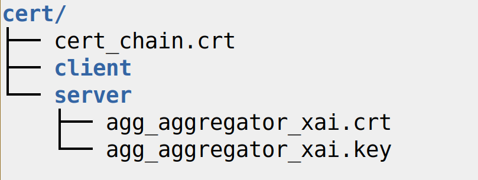
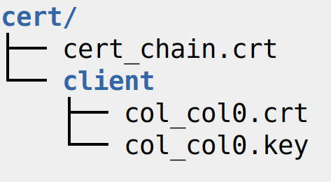

# Setup and run a custom Fed-XAI process
This section outlines the necessary modifications for executing a custom user-defined FL process. 
We assume that the process will be performed within Docker containers, exploiting the Dockerfiles provided for the Illustrative Example. 
The changes we envisage in this customization guide encompass adjustments to the number of participants, the local data, and the ML model employed within the FL process.

## Repository Structure

```bash
├── openfl-xai_workspaces                   # folder containing two OpenFL workspaces, namely:
│   ├── xai_frbs_generic                    	# Openfl-XAI workspace template containing all the customized classes to enable FL of XAI models.
│   ├── xai_tsk_frbs                        	# workspace of a first order TSK-FRBS, based on the Openfl-XAI workspace. This workspace is used in the Illustrative Example.
├── certificates                            # folder containing certificates used by Aggregator and Collaborators to prove their identity.
├── data                                    # folder containing the private data of the Collaborators, to be used for local model training.
├── configuration.json                      # json file in which the name of the XAI model to be used is specified.
├── docker-compose.yml                      # file used to generate Docker images to deploy Openfl-XAI components in Docker containers.
├── Dockerfile.openfl_xai                   # file used to generate Docker images to deploy Openfl-XAI components in Docker containers.
├── Dockerfile.xai_aggregator               # file used to generate Docker images to deploy Openfl-XAI components in Docker containers.
├── Dockerfile.xai_collaborator             # file used to generate Docker images to deploy Openfl-XAI components in Docker containers.
├── global_models                           # folder for storing aggregated model.
├── logs                                    # folder for storing containers logs.
├── terminal_interface.py                   # Python module implementing a command line interface for executing the Illustrative Example.
├── OpenFL_changelog.txt                    # changes made in OpenFL-XAI as extension of the OpenFL base components.
├── use_case_requirements.txt               # dependencies needed to execute the Illustrative Example. These requirements are installed in the Docker images.
├── Illustrative_Example.md                 # documentation: guide to execute an illustrative example for FL of first-order TSK-FRBS.
├── Customization_Guide.md                  # documentation: guide to customize FL process with your own models and settings.
└── images                                  # utility folder for documentation images.
```


## 1. Customize your workspace

In OpenFL, each participant to the FL process must own a workspace folder with the overall configuration information. 
The FL process is configured through the `plan.yaml` file, contained within the workspace folder. 
It includes pointers to OpenFL and OpenFL-XAI components classes (e.g., AggregatorXAI and CollaboratorXAI) with the respective parameters. 
It also specifies the address and the port to be used by the Collaborators to communicate with the Aggregator. 
Information stored in the workspace includes also the list of participants' names, the PKI certificates and the source code for the extended OpenFL components (please refer to [1] and [OpenFL docs][openfl-docs] for further details).

To realize a customized federation in OpenFL-XAI, a generic workspace (named `xai_frbs_generic`) is provided within the `openfl-xai_workspaces` directory. 
The required modifications to the `xai_frbs_generic` workspace are described in the following.

### 1.1 Certificates

OpenFL requires that every participant in the federation has a valid PKI certificate.
> Certificates are used to establish a mutually-authenticated TLS connection to allow Collaborators and Aggregator to communicate.

Within the `/certificates` folder of the OpenFL-XAI repository, we include one Aggregator and five Collaborators self-signed certificates complying with the X.509 standard and issued by a private OpenSSL Certification Authority (CA). When the Docker image of the Aggregator component is generated, its certificate is retrieved according to the path specified in the relevant Dockerfile. As a consequence, when the container based on the Aggregator image is started, the certificate is already loaded in its file system. 
A Collaborator's certificate is loaded when its container is instantiated according to the path specified in `docker_compose.yml`.
The available certificates allow to execute a federation with up to five Collaborators.

To enable more than five Collaborators to participate in the FL process, it is recommended to generate from scratch all the certificates for the Aggregator and the Collaborators, taking care to adhere to incremental indexing in the naming process.

#### Certificate generation from scratch
In the workspace, certificates are stored as `.zip` archive: the compressed folder must be organized according to a defined structure, both for the Aggregator and the Collaborators.

- The structure of the `/cert` folder for an Aggregator named **aggregator_xai** is reported in the following snapshot. The `.zip` archive is named **aggregator_cert_folder.zip**.

<p align="center">
	
</p>

- The structure of the  `/cert` folder for a Collaborator (named **col0**, as an example) is reported in the following snapshot. The `.zip` archives for Collaborators are named according to the incremental indexing policy. For example, the certificate for **col0** will be compressed in the `col0_cert_folder.zip` archive

<p align="center">
	
</p>

The **cert_chain.crt** file, reported in both previous figures, represents the public certificate of the CA used to sign the Aggregator and Collaborators certificates.

Please note that the aforementioned naming policy for the `.zip` archives is related to the instructions within the Dockerfiles and `docker-compose.yml` file provided in the repository. 

### 1.2 Data

The local data for each Collaborator are supposed to be located in the `/data` folder and stored in `.zip` format.
The archives must be named according to the incremental indexing policy: for example, `col0_data.zip` hosts the data for the Collaborator named **col0**.
The zip archive is supposed to contain two binary files in NumPy `.npy` format, namely `X_train.npy` (array-like with shape `(n_samples, n_features)`) and `y_train.npy` (array-like with shape `(n_samples,)`), holding the training data and the related ground truth, respectively.

### 1.3 Model
The customized Model source code files (extending the `Model` class) must be included in the `xai_frbs_generic/src/model` folder. 

### 1.4 Plan

In the `xai_frbs_generic/plan` directory, the following files must be modified:

- `cols.yml`: include the names of the Collaborators participating in the federation 
- `data.yml`: for each Collaborator, write an entry `<collaborator_name,data_folder_path>`. By default, the `data_folder_path` is simply `data` for each Collaborator.
- `plan.yml`: 
    -  in the `task_runner` section modify
        -  **dict_model** to point at the customized Model
        -  **dict_parameters** to specify the hyperparameters of the customized Model.

## 2. Additional Adjustment

- In `docker_compose.yml`, include the entries for the actual number of Collaborators.
- In `Dockerfile.xai_collaborator` replace `./openfl-xai_workspaces/xai_tsk_frbs` with `./openfl-xai_workspaces/xai_frbs_generic`
- In `Dockerfile.xai_aggregator` replace `./openfl-xai_workspaces/xai_tsk_frbs` with `./openfl-xai_workspaces/xai_frbs_generic`

## 3. Run the Federation

To execute the federation, follow all the steps in the [Illustrative Example](#illustrative-example) section.


# Citations

1. M. Daole, A. Schiavo, P. Ducange, A. Renda, J. L. Corcuera Bárcena, F. Marcelloni, "OpenFL-XAI: Federated Learning of Explainable Artificial Intelligence Models in Python" Elsevier SoftwareX, Volume 23, 2023, 101505, DOI: https://doi.org/10.1016/j.softx.2023.101505

```
@article{openfl-xai_citation,
	author={Daole, Mattia and Schiavo, Alessio and Corcuera B{\'a}rcena, Jos{\'e} Luis and Ducange, Pietro and Marcelloni, Francesco and Renda, Alessandro},
	title={OpenFL-XAI: Federated Learning of Explainable Artificial Intelligence Models in Python},
	journal = {SoftwareX},
	volume = {23},
	pages = {101505},
	year = {2023},
	issn = {2352-7110},
	doi = {https://doi.org/10.1016/j.softx.2023.101505},
}
```

2.  J. L. Corcuera Bárcena, P. Ducange, A. Ercolani, F. Marcelloni, A. Renda, An Approach to Federated Learning of Explainable Fuzzy Regression Models, in: 2022 IEEE International Conference  in Fuzzy Systems (FUZZ-IEEE), IEEE, 2022, pp. 1–8. doi:10.1109/FUZZ-IEEE55066.2022.9882881.

```
@INPROCEEDINGS{CorcueraBarcena-FedTSK,   
  author={Corcuera B{\'a}rcena, Jos{\'e} Luis and Ducange, Pietro and Ercolani, Alessio and Marcelloni, Francesco and Renda, Alessandro},   
  booktitle={2022 IEEE International Conference on Fuzzy Systems (FUZZ-IEEE)},   
  title={An Approach to Federated Learning of Explainable Fuzzy Regression Models},   
  year={2022},   
  volume={},
  number={},
  pages={1-8},
  doi={10.1109/FUZZ-IEEE55066.2022.9882881}}
```

3. P. Foley et al., "OpenFL: the open federated learning library", Physics in Medicine & Biology (2022). doi:10.1088/1361-6560/ac97d9.
```
@article{openfl_citation,
	author={Foley, Patrick and Sheller, Micah J and Edwards, Brandon and Pati, Sarthak and Riviera, Walter and Sharma, Mansi and Moorthy, Prakash Narayana and Wang, Shi-han and Martin, Jason and Mirhaji, Parsa and Shah, Prashant and Bakas, Spyridon},
	title={OpenFL: the open federated learning library},
	journal={Physics in Medicine \& Biology},
	url={http://iopscience.iop.org/article/10.1088/1361-6560/ac97d9},
	year={2022},
	doi={10.1088/1361-6560/ac97d9},
	publisher={IOP Publishing}
}
```

[Barcena2022]: https://ieeexplore.ieee.org/document/9882881
[docker-engine-setup]: https://docs.docker.com/engine/install/ubuntu/#install-docker-engine 
[hexa]: https://hexa-x.eu/
[docker-docs]:https://docs.docker.com/get-started/
[docker-file]:https://docs.docker.com/engine/reference/builder/
[docker-compose]: https://docs.docker.com/compose/
[keel]:http://www.keel.es/
[openfl]: https://github.com/securefederatedai/openfl
[openfl-docs]: https://openfl.readthedocs.io/en/latest/index.html
