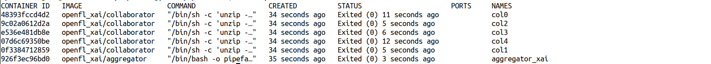
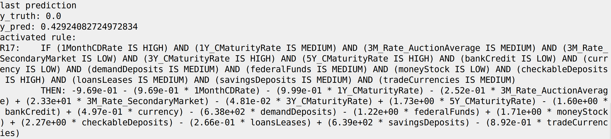
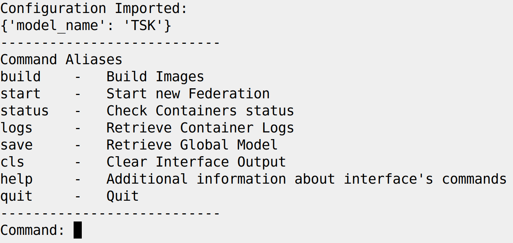

# Illustrative Example 

In this example, the usage of the OpenFL-XAI framework is illustrated. We show a Fed-XAI scenario in which five Collaborators train a first order TSK-FRBS in a federated fashion.  

The illustrative example has been tested on Ubuntu 22.04.

We adopt a virtualized architecture based on Docker: each entity participating in the federation (Aggregator and Collaborators) is deployed into a Docker container. To this end, base Docker images must be generated. 
> A Docker image is an immutable file comprising the necessary components for the execution of an application, including source code, libraries, dependencies, tools and additional files. 
> A Docker image is built by the Docker engine according to the instructions provided in a textual document called Dockerfile. 
A Docker container is a runnable instance of an image (for more details, please refer to  [Docker documentation][docker-docs]).

A minimal command line interface (CLI) is provided to assist the user in the execution of this illustrative example.
The user can choose whether to [issue commands step-by-step through a terminal](#illustrative-example-step-by-step-procedure) or to [use the CLI](#illustrative-example-python-command-line-interface).

For the purposes of this example, the popular Mortgage regression dataset is used, appropriately partitioned over the five Collaborators. Furthermore, a hold-out test set is retained for inference purpose and can be used for assessing the generalization capability of the model.
The dataset is publicly available and can be retrieved from the [Keel][keel] repository.


## Illustrative example: step by step procedure

### 1. Generating required images
The docker images for the illustrative example are generated as follows, through dedicated Dockerfiles. 


#### 1.1 Base image: openfl_xai

The **openfl_xai** image is generated based on the instructions in `Dockerfile.openfl_xai`. The image contains an OpenFL installation and the other dependencies required to execute the FL of TSK-FRBSs, as specified in the `requirements.txt` file within a dedicated collection of configuration files named *workspace*. This image is used as base image to generate the Aggregator and base Collaborator image. 

Type from the root folder: 
```bash
docker build -f Dockerfile.openfl_xai -t openfl_xai .
```

#### 1.2 AggregatorXAI

The Aggregator image is defined by the `Dockerfile.aggregator` file starting from the **openfl_xai** image. It adds the federation workspace and the aggregator's certificate.

Type from the root folder: 
```bash
docker build -f Dockerfile.xai_aggregator -t openfl_xai/aggregator .
```
The resulting Aggregator image will be named as follows:
- **openfl_xai/aggregator**

#### 1.3 CollaboratorXAI

A base Collaborator image is defined by the `Dockerfile.xai_collaborator` file starting from the **openfl_xai** image, and includes the federation workspace. Each Collaborator's container will be instantiated from this base Collaborator image. The specific elements of each Collaborator's container (i.e., certificate and private data) will be added through the Docker compose functionality as an external volume (see Section 2).

Type from the root folder: 

```bash
docker build -f Dockerfile.xai_collaborator -t openfl_xai/collaborator .
```

The resulting base Collaborator image will be named as follows:
- **openfl_xai/collaborator**

### 2. Federated Learning Process

Once images are generated, the [Docker compose][docker-compose] functionality offered by Docker is used to start the containers of the OpenFL-XAI components. Docker compose allows to configure and start multiple containers at once by defining a YAML file named `docker-compose.yml`. This file defines how many containers will be created, along with their names, environment variables, external volumes (if any), and dependencies between containers.

```bash
docker compose up -d
```

In our example six Docker containers are created, one for the Aggregator and five for the Collaborators.
Once instantiated, the containers automatically start the relative OpenFL components, namely the Aggregator and the Collaborators.

At this point, the FL process will be executed and will yield a TSK-FRBS built in a collaborative and privacy-preserving fashion by five Collaborators.

> Aside: for the convenience of users familiar with [OpenFL bare-metal approach][baremetal] we hereby report the equivalent commands for starting the FL process, which do not involve the use of Docker.
> - On the terminal of the Aggregator node, navigate to the federation workspace folder and execute the command `fx aggregator start`. This command will start an Aggregator instance that waits for the Collaborators to establish connections.
> - On each Collaborator node, navigate to the workspace folder and execute the command `fx collaborator start -n <collaborator_name>`
> 
> Note that this guide only describes federation via docker. Dedicated workspaces must be designed for the bare-metal approach.

### 3. Monitor Containers Status

Once the containers start, the status of the containers can be monitored through the command:
```bash
docker ps -a
```
An example of a log is shown in the following snapshot:



The "Exited" status for all the containers indicates that the FL process is complete.

### 4. Retrieve Logs

Throughout the FL process, each container provides information about its execution. The `docker logs` command can be used to retrieve such information.

- To visualize the logs of a specific container (e.g., col0 in the following example), type:
  ```bash 
  docker logs col0 
  ```
- To save the logs of the specific container in a text file, type:
  ```bash
  docker logs col0 > ./logs/col0.txt
  ```
### 5. Store Federated Model

At the end of the FL process, the Aggregator saves the global model into three files in NumPy `.npy` format before terminating its execution. These three files represent the **antecedents**, **consequents** and **rule weights** of the generated TSK-FRBS.

To move these files from the file system of the Aggregator container to the local file system, execute the following commands:
```bash
docker cp aggregator_xai:/current_workspace/TSK_global_model_rules_antec.npy ./global_models/tsk/TSK_global_model_rules_antec.npy
docker cp aggregator_xai:/current_workspace/TSK_global_model_rules_conseq.npy ./global_models/tsk/TSK_global_model_rules_conseq.npy
docker cp aggregator_xai:/current_workspace/TSK_global_model_weights.npy ./global_models/tsk/TSK_global_model_weights.npy
```

### 6. Inference
In this section we provide a guide to initialize the federated, *global*, model generated through the FL process and to exploit such a model to perform inference over a batch of data. All the following commands must be executed from the root of the repository, with any interface to a Python3 interpreter.

#### Initialize Model

```python
import numpy as np
import importlib

fuzz_module = importlib.import_module("openfl-xai_workspaces.xai_tsk_frbs.src.model.fuzzySystem")
fuzzySystem_class = getattr(fuzz_module, "FuzzySystem")

feature_names = ["1MonthCDRate","1Y_CMaturityRate","3M_Rate_AuctionAverage","3M_Rate_SecondaryMarket","3Y_CMaturityRate","5Y_CMaturityRate","bankCredit","currency","demandDeposits","federalFunds","moneyStock","checkableDeposits","loansLeases","savingsDeposits","tradeCurrencies"]

antecedents = np.load("./global_models/tsk/TSK_global_model_rules_antec.npy")
consequents = np.load("./global_models/tsk/TSK_global_model_rules_conseq.npy")
weights = np.load("./global_models/tsk/TSK_global_model_weights.npy")

model = fuzzySystem_class(variable_names=feature_names,
            antecedents=antecedents,
            consequents=consequents,
            rule_weights=weights)
```
This snippet relies on the implementation of the TSK-FRBS available in the dedicated `openfl-xai_workspaces.xai_tsk_frbs` workspace (Python module `src.model.fuzzySystem`, please refer to [Bárcena et al., 2022][Barcena2022] for more details).
The `feature_names` variable is initialized with actual feature names of the dataset (in our example, the Mortgage dataset).

#### Global Interpretability
```python
print("number of rules: " + str(model.get_number_of_rules()))
rules = model.__str__()
with open("./global_models/interpretable_rules.txt","w") as file:
  file.write(rules)  
```
The snippet above allows evaluating the number of rules of the TSK-FRBS (through the **get_number_of_rules** method), which can be used to quantitatively evaluate the global explainability of the model. A comprehensive view of the whole collection of rules can be obtained by saving into a text file the output of the model **\_\_str\_\_** method, which properly converts numeric tensors in a human-readable format.

#### Predict

The inference process is carried out on a dedicated test set stored in a Numpy file named `X_test.npy` (array-like with shape `(n_samples, n_features)`) within the `data` folder. 

```python
X_test = np.load("./data/X_test.npy")
y_pred =  model.predict(X_test)
y_true = np.load("./data/y_test.npy")
```

The model object also exposes the **predict_and_get_rule** method which returns predictions and the index of the activated rule.

```python
X_test = np.load("./data/X_test.npy")
y_true = np.load("./data/y_test.npy")
y_pred_and_activated_rules_samples = model.predict_and_get_rule(X_test)
y_pred = [tup[0] for tup in y_pred_and_activated_rules_samples]
activated_rules = [tup[1] for tup in y_pred_and_activated_rules_samples]

rule_adopted = model.get_rule_by_index(activated_rules[-1]+1)
print("last prediction: ")
print("y_true: " + str(y_true[-1]))
print("y_pred: "+str(y_pred[-1]))
print("activated rule:")
print(rule_adopted)

```
To take vision of the local interpretability of the model, we can adopt the method **get_rule_by_index** in correspondence of a specific test sample to ascertain which rule has been adopted by the model to compute the output.


<p align="center">
  
</p>

In addition, we can compute well known regression metrics exploiting the ground truth and predicted values.
```python
from sklearn.metrics import r2_score
r2 = r2_score(y_true, y_pred)
print(r2)
```

## Illustrative example: Python Command Line Interface

A command line interface is provided to aid the user in executing the experiment. 
Run the following command to start the CLI:

```bash
python3 terminal_interface.py 
```
Snapshot of the terminal showing the CLI:
<p align="center">
  
</p>
By executing the command aliases in the reported order, a user can reproduce the step-by-step procedure described in the previous section.

[baremetal]: https://openfl.readthedocs.io/en/latest/running_the_federation.html#bare-metal-approach
[Barcena2022]: https://ieeexplore.ieee.org/document/9882881
[docker-engine-setup]: https://docs.docker.com/engine/install/ubuntu/#install-docker-engine 
[hexa]: https://hexa-x.eu/
[docker-docs]:https://docs.docker.com/get-started/
[docker-file]:https://docs.docker.com/engine/reference/builder/
[docker-compose]: https://docs.docker.com/compose/
[keel]:http://www.keel.es/
[openfl]: https://github.com/securefederatedai/openfl
[openfl-docs]: https://openfl.readthedocs.io/en/latest/index.html
